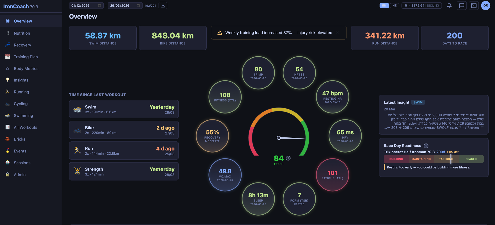
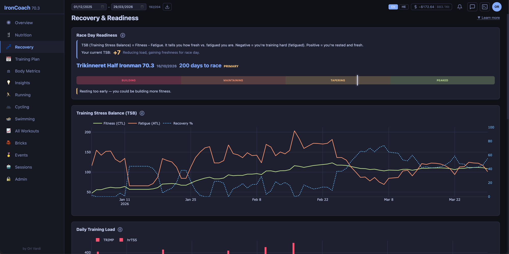
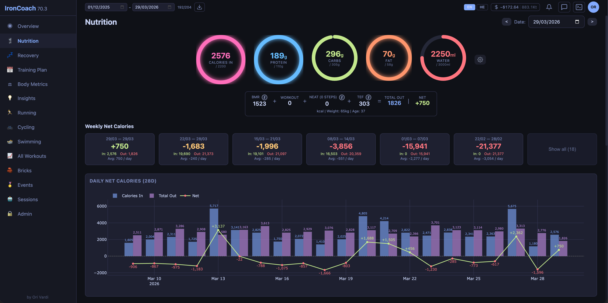
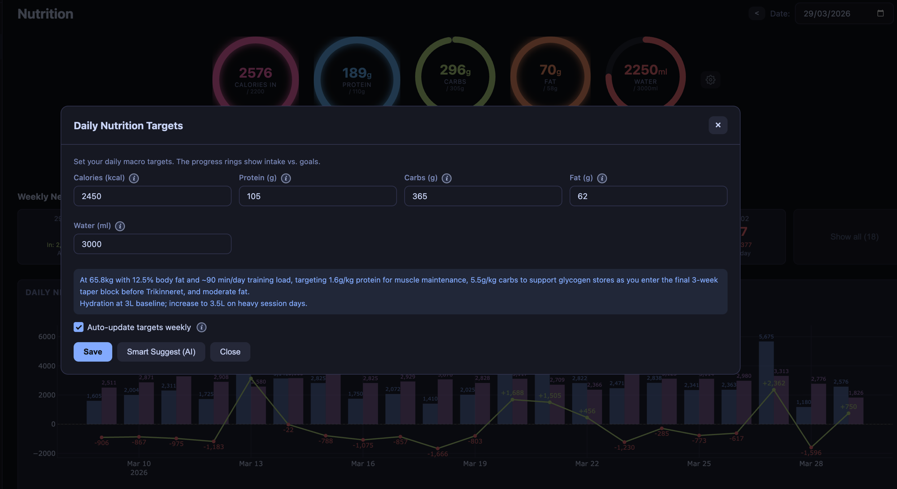
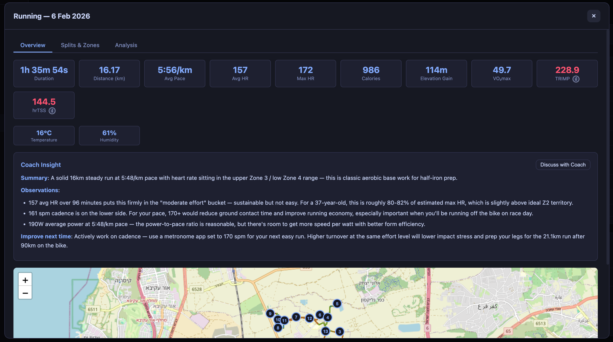

# IronCoach — Training Dashboard

> **Version 0.1.0** | Last updated: 2026-03-31

A self-hosted training dashboard powered by Apple Health data and Claude AI coaching agents.

Tracks swim, bike, run, strength, and other workouts with AI-generated insights, nutrition logging, body metrics, and multi-agent coaching chat.

**All analytics (charts, tables, splits, HR zones) are computed in Python — no AI tokens spent.** AI is only used for coaching chat and workout insight generation.

## Why

Apple's Fitness and Health apps collect great data from Apple Watch — heart rate, GPS, pace, cadence, power, swim strokes — but make it surprisingly hard to actually analyze your training. You can see individual workouts, but there's no way to track trends over time, compare sessions, understand recovery load, or get meaningful coaching feedback.

I looked for a free app that would give me real insight into my training data without a subscription or sending my health data to someone else's server. I couldn't find one. So I built this — a local dashboard that reads your own Apple Health export and turns it into actionable training analytics, with optional AI coaching on top.

## Screenshots

| Overview | Recovery |
|:---:|:---:|
|  |  |

| Nutrition | Nutrition Targets (AI) |
|:---:|:---:|
|  |  |

| Workout Detail |
|:---:|
|  |

## Status

This is an **active, ongoing project** under continuous development. Features may change, break, or be redesigned between updates. Expect bugs, incomplete functionality, and evolving UI. If something doesn't work as expected, it's likely already on the radar or will be addressed in a future update.

## Important Notes

This dashboard uses AI (Claude) for coaching insights, workout analysis, and nutrition recommendations. Like any LLM, **it can produce inaccurate or incorrect information**. A basic understanding of health, fitness, and training concepts is expected so you can recognize when the AI gets something wrong and avoid making harmful decisions based on bad advice. **AI coaching is not a substitute for professional medical or coaching advice.**

## Disclaimer

This software is provided **as-is**, with no warranty of any kind. The developer assumes **no responsibility** for any damages, data loss, costs, or other issues arising from use of this software. You are solely responsible for your API costs, data, and how you use this tool. Use at your own risk.

**This entire project was built using vibe coding with Claude Code** — meaning the code was generated through AI-assisted development via natural language conversations, not traditional manual programming. While effort has been made to add security measures (authentication, input validation, CSRF protection), the codebase has not undergone a professional security audit. It is designed for **localhost use only** and should **not** be exposed to the public internet. Expect rough edges, potential security vulnerabilities, and code patterns that reflect iterative AI-guided development rather than conventional software engineering practices.

## Quick Start

### Prerequisites

| Requirement                | Purpose                                            |
|:---------------------------|:---------------------------------------------------|
| **iPhone**                 | Apple Health stores all workout data               |
| **Python 3.11+**           | Backend server                                     |
| **Node.js 18+ & npm**     | Build frontend (one-time, or use pre-built)        |
| **Claude CLI**             | AI coaching (optional — dashboard works without it)|
| **Mac or Linux**           | Runs locally only                                  |

### Option A: Setup Script (Recommended)

```bash
chmod +x setup.sh start.sh
./setup.sh    # Install deps + build frontend (one-time)
./start.sh           # Start the server → http://localhost:8000
./start.sh --build   # Rebuild frontend + start (auto-installs npm deps if needed)
```

### Option B: Manual Setup

```bash
cd backend && pip install -r requirements.txt && cd ..
cd frontend && npm install && npm run build && cd ..
cd backend && python3 server.py    # → http://localhost:8000
```

On first visit, create an admin account. Then import your Apple Health data via the sidebar Import button.

### Exporting Apple Health Data

1. Open the **Health** app on your iPhone
2. Tap your **profile picture** (top-right)
3. Scroll down and tap **Export All Health Data**
4. Confirm — this may take a few minutes depending on how much data you have
5. When ready, share/save the `export.zip` file to your Mac
6. In IronCoach, click the **Import** button in the sidebar and point it to the exported folder (zip or unzipped)

The import copies `export.xml` and route files locally, then processes them into per-workout CSVs. Your original export stays untouched.

> **Note**: IronCoach works with any device that syncs to Apple Health — not just Apple Watch. If your Garmin, Polar, Suunto, Wahoo, or other device writes data to Apple Health (directly or via Strava/third-party apps), it will be included in the export.

## Features Overview

See **[FEATURES.md](docs/FEATURES.md)** for detailed documentation of every feature.

| Category                   | What It Does                                       |
|:---------------------------|:---------------------------------------------------|
| Workout Analytics          | Charts, tables, splits, HR zones, GPS maps, interval detection |
| Detailed Workout Data      | Pre-computed intervals, HR/elevation profiles, interval map (work/rest colored) |
| Body Metrics               | Weight, body fat%, muscle mass, BMI with ranges    |
| Recovery Dashboard         | CTL/ATL/TSB, TRIMP/hrTSS, sleep, HRV, VO2max, phase-aware status |
| Race Day Readiness         | TSB bar with labeled zones, phase-aware recommendations |
| Risk Alerts                | Load spike, low recovery, poor sleep, elevated HR, low HRV |
| Brick Detection            | Auto-detects multi-discipline sessions (<30 min)   |
| GPS Anomaly Filtering      | Detects and removes bad GPS points                 |
| Training Plan              | Proportional phase bar (Build→Mid→Peak→Taper), plan vs actual |
| Events / Races             | Multi-event tracking with countdown                |
| AI Workout Insights        | Per-workout analysis by specialist coaches         |
| AI Coaching Chat           | Multi-agent chat (main + specialists)              |
| Nutrition Tracking         | Progress rings, AI meal analysis, Smart Suggest targets, weekly auto-suggest, energy balance |

## AI Features & Cost

AI features require the [Claude CLI](https://docs.anthropic.com/en/docs/claude-code). Without it, the dashboard still shows all charts, tables, and data — just no chat or AI insights.

### Claude CLI Setup

```bash
npm install -g @anthropic-ai/claude-code
claude    # Authenticate
```

### Cost Awareness

AI costs depend on the Claude model you use and your usage patterns. Costs are based on [Anthropic's pricing](https://www.anthropic.com/pricing). Admins can override the model in Admin > Sessions > Settings (e.g., use Haiku for lower cost).

**Token usage is tracked per-user** and visible in the topbar and Admin page with per-agent, per-model, and daily breakdowns. **Important:** Token counts and cost estimates are approximate — they are parsed from Claude CLI output and may not exactly match your actual API billing. We take no responsibility for cost discrepancies. Always check your official Anthropic/AWS/GCP billing dashboard for accurate charges.

### Token Cost Optimization

The project aims to minimize AI token costs where possible:

| Strategy | How It Works |
|:---------|:-------------|
| **Python-local analytics** | All charts, tables, splits, HR zones, GPS maps computed in Python — zero AI tokens |
| **Direct agent calls** | Insight generation calls specialist agents directly, bypassing the orchestrator |
| **One-shot meal analysis** | Nutrition AI uses a single prompt with no session file — no accumulated context |
| **Session rotation** | Chat JSONL files auto-rotate at configurable threshold to prevent unbounded context growth |
| **Prompt caching** | Agent definitions loaded as system prompts, enabling Anthropic's automatic prompt caching |
| **Specialist delegation** | Main-coach delegates to focused specialist agents with smaller context |
| **Agent model override** | Admin can set a cheaper model for all AI calls without changing agent definitions |
| **Selective insight generation** | Post-import modal lets users pick which workouts get AI insights |
| **Per-workout raw data toggle** | Include detailed CSV time-series only for selected workouts — not a global toggle. Most workouts use summary data only. |
| **Dismiss skipped workouts** | Workouts you skip in post-import won't reappear next time — no wasted regeneration |
| **Python-local interval detection** | Work/rest intervals, HR/elevation profiles, cardiac drift all computed in Python — zero AI tokens |
| **GPS separated from CSV** | GPS data stored in GPX route files, not in main CSV — reduces token count when raw data is sent to coaches |
| **No AI for data display** | All workout, recovery, body metrics, and plan data rendered directly from CSV/SQLite |

### Claude Code Integration

This project makes extensive use of **Claude Code** (Anthropic's CLI for Claude):

- **13 Agent definitions** (`.claude/agents/`): 5 coaching agents (main, run, swim, bike, nutrition), 4 dev agents (main-dev, frontend, backend, data-pipeline), 4 review agents (security, frontend, backend, data)
- **11 Skills** (`.claude/skills/`): Reusable prompt templates — code review, cleanup, coaching analysis (run/swim/bike/nutrition/overview), architecture docs (frontend/backend/data-model), project patterns
- **CLAUDE.md**: Project-level instructions auto-loaded by Claude Code
- **Multi-agent delegation**: Main-coach delegates to specialist agents via `ToolSearch` + `Agent` tools

See **[FEATURES.md](docs/FEATURES.md#claude-code-integration)** for the full agent/skill reference.

### Agent Tool Permissions

When the server calls Claude CLI agents, it explicitly passes `--allowed-tools` per invocation — **no interactive permission prompts**. The allowed tools per agent type:

| Agent Type | Allowed Tools | Why |
|:-----------|:--------------|:----|
| **Coaching specialists** (run/swim/bike/nutrition) | `Read`, `Grep`, `Bash` | Read workout CSVs and raw time-series data for analysis |
| **Main coach** | `ToolSearch`, `Read`, `Grep`, `Bash`, `Agent` | Delegates to specialist agents, reads data |
| **Dev agents** (main-dev, frontend, backend, etc.) | `ToolSearch`, `Read`, `Edit`, `Write`, `Grep`, `Glob`, `Bash`, `Agent` | Full toolset for code changes (admin-only) |
| **One-shot calls** (meal analysis, insights) | None (prompt only) | Single prompt/response, no tool use needed |

All agents are also explicitly **denied** destructive Bash commands (`rm`, `rm -rf`, `rmdir`, `mv`) via `--disallowed-tools`, preventing file deletion or moves outside the project scope.

A `settings.local.json` is tracked in the repo with deny rules for destructive commands (`rm`, `rmdir`). Server agent permissions are controlled in code via `--allowed-tools` / `--disallowed-tools`.

## Configuration

### Environment Variables

Create a `.env` file in `backend/` to set configuration:

```bash
# Example .env
PORT=8000                          # Server port (default: 8000)
```

| Variable              | Default   | Description                                        |
|:----------------------|:----------|:---------------------------------------------------|
| `PORT`                | `8000`    | Server port                                        |
| `CLAUDE_CLI`          | `claude`  | Claude CLI binary name or path                     |

### Claude CLI Binary

By default, the server looks for `claude` in your PATH. To use a different binary (e.g., a wrapper script for AWS Bedrock), set the `CLAUDE_CLI` environment variable in your `.env` file:

```bash
CLAUDE_CLI=ai                        # Use 'ai' from PATH
CLAUDE_CLI=/usr/local/bin/my-wrapper  # Or an absolute path
```

### Admin Settings (In-App)

| Setting                  | Location                        | Description                                    |
|:-------------------------|:--------------------------------|:-----------------------------------------------|
| AI Enabled               | Admin > Settings                | Master toggle for all AI features (default off)|
| Agent Model Override     | Admin > Sessions > Settings     | Override Claude model for all AI calls         |
| Chat Summary Mode        | Admin > Sessions > Settings     | How context is built after session rotation    |
| Session Rotation         | Admin > Settings                | JSONL rotation threshold (default 800KB)       |
| Auto Merge               | Admin > Settings                | Auto-merge gap in minutes (default 10)         |
| Upload Cleanup           | Admin > Settings                | Max upload folder size (default 200MB)         |
| Nutrition Auto-Suggest   | Admin > Settings                | Weekly AI nutrition targets (Sundays 06:00)    |
| User Management          | Admin > Users                   | View users, usage stats, manage accounts       |
| Agent Definitions        | Admin > Agent Definitions       | View/edit coaching agent prompts               |

### Password Reset

- **Regular users**: Change your own password via the user avatar menu > "Change Password"
- **Admin password reset (destructive)**: Delete `backend/data/dashboard.db` and restart. First visitor creates new admin. **This resets all data.**
- **Admin password reset (preserve data)**:
  ```bash
  cd backend
  python3 -c "
  from auth import hash_password
  print(hash_password('your_new_password'))
  " | xargs -I{} sqlite3 data/dashboard.db "UPDATE users SET password_hash = '{}' WHERE username = 'admin';"
  ```
- **Admin resets other users**: Admin > Users page, edit user accounts.

## Data & Privacy

- **All data stays local** — no external services except Claude API calls for AI coaching
- **No telemetry** — nothing is sent anywhere except your Claude API calls
- SQLite database in `data/dashboard.db` — auto-backup on server startup (keeps last 3)
- JWT secret auto-generated in `data/.jwt_secret`
- Agent data operations use structured ACTION blocks — executed server-side with user's auth context
- Uploaded files (chat images) stored in `data/uploads/` — auto-cleaned when exceeding threshold (default 200MB, configurable in Admin Settings)

## Tech Stack

| Layer        | Technology                                              |
|:-------------|:--------------------------------------------------------|
| Frontend     | React 18, Vite, Plotly.js, Leaflet, react-router-dom   |
| Backend      | Python FastAPI, SQLite (aiosqlite), Uvicorn             |
| AI           | Claude CLI agents (Anthropic), multi-agent architecture |
| Data Source  | Apple Health XML export                                 |
| Auth         | JWT (HMAC-SHA256), multi-user with roles                |

## Project Structure

```
ironCoach/
├── setup.sh                         # One-time setup (install deps + build)
├── start.sh                         # Start the server (--build to rebuild frontend)
├── CLAUDE.md                        # Project instructions for Claude Code
├── scripts/
│   └── export_to_csv.py            # Data pipeline: XML -> CSVs
├── training_data/                   # Processed workout data (gitignored, created on import)
│   ├── export.xml                  # Apple Health export (copied on import)
│   ├── workout-routes/             # GPX route files (copied on import)
│   └── users/{uid}/                # Per-user CSVs, splits, events
├── docs/
│   ├── FEATURES.md                 # Detailed feature documentation
│   └── screenshots/                # UI screenshots
├── .claude/
│   ├── agents/                      # 13 Claude CLI agent definitions
│   └── skills/                      # 11 reusable Claude Code skills
├── backend/
│   ├── server.py                    # FastAPI entry point (app, middleware, routers)
│   ├── config.py                    # Shared constants, paths, logging
│   ├── database.py                  # SQLite schema & CRUD (aiosqlite)
│   ├── auth.py                      # JWT authentication
│   ├── routes/                      # 16 API route modules (APIRouter per domain)
│   ├── services/                    # 7 business logic modules (chat, CLI, insights, scheduler)
│   ├── data_processing/             # 7 pure data modules (recovery, GPS, summary, analysis)
│   ├── tests/                       # pytest tests (security, data integrity)
│   ├── .env                         # Environment config (gitignored)
│   └── data/                        # SQLite DB, uploads, logs (gitignored, auto-created)
└── frontend/
    └── src/
        ├── App.jsx                  # Routes + auth gate
        ├── api.js                   # API helper (401 handling)
        ├── context/                 # Auth, App, Chat contexts
        ├── components/              # Layout, Chat, Modals, common UI
        ├── pages/                   # 16 pages (Overview, Running, Cycling, etc.)
        ├── utils/                   # classifiers, formatters, constants
        ├── styles/theme.css         # Dark theme (Moonlight-inspired)
        └── i18n/                    # EN + HE translations
```

## Development

```bash
# Frontend dev server with hot reload (proxies API to :8000)
cd frontend && npm run dev

# Backend (in another terminal)
cd backend && python3 server.py
```

After frontend changes: `cd frontend && npm run build`

## License

This project is licensed under the **GNU General Public License v3.0** — see [LICENSE](LICENSE) for details.
 
